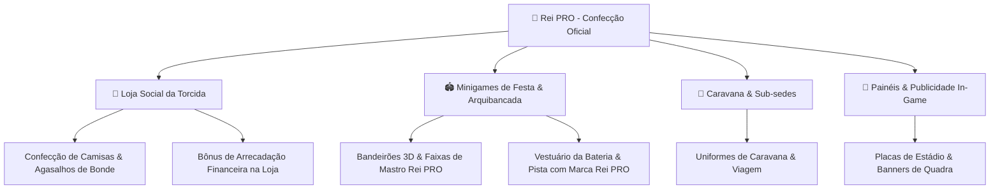

# 🏆 Proposta Comercial de Patrocínio & Integração In-Game
## Bancada Simulator x Rei PRO Uniformes Esportivos

---

## 1. Visão Geral do Projeto

**Bancada Simulator** é um jogo de estratégia, gestão e simulação de arquibancada e torcidas organizadas do futebol brasileiro. No jogo, o jogador assume a liderança de uma grande agremiação de arquibancada, gerando engajamento de massa, coordenando caravanas, organizando festas com bandeirões e baterias, e gerindo a loja social da torcida.

### 👥 Público-Alvo e Alcance
- **Público**: Torcedores engajados, integrantes de torcidas organizadas, colecionadores de camisas, atletas de várzea, praticantes de futebol e fãs de gestão esportiva.
- **Perfil Demográfico**: Homens e mulheres de 18 a 45 anos, com alto interesse em vestuário esportivo, agasalhos, uniformes de sub-sedes, artigos de bateria e confecção de faixas.
- **Conexão Direta**: O público do jogo é exatamente o consumidor final da **Rei PRO Uniformes Esportivos**.

---

## 2. Por que Patrocinar o Bancada Simulator?

Diferente de anúncios tradicionais (banners estáticos ou pop-ups intrusivos), a integração da **Rei PRO** no **Bancada Simulator** acontece de forma **orgânica, contextualizada e nativa da mecânica do jogo**. A marca torna-se parte da jornada de sucesso do jogador dentro da simulação.

> [!IMPORTANT]
> **Integração Comercial Única**: A Rei PRO não é apenas exibida como uma marca visual, mas atua como a **Fornecedora Oficial de Confecção, Uniformes e Adereços de Arquibancada** dentro do ecossistema do jogo, agregando valor real ao progresso da torcida do jogador.

---

## 3. Oportunidades de Integração no Jogo para a Rei PRO

Abaixo apresentamos as formas exclusivas em que a marca **Rei PRO** será inserida no jogo:

---

### 🎨 A. Fornecedora Oficial da Loja Social (`Sistema de Loja & Merchandising`)
- **Mecânica**: Na aba de gestão financeira e comércio da torcida, a **Rei PRO** é destacada como a parceira de confecção exclusiva.
- **Item Especial In-Game**: *"Lote de Uniformes & Agasalhos Oficiais Rei PRO"*.
- **Impacto no Jogo**: Comprar artigos confeccionados pela Rei PRO aumenta a **Autonomia Financeira (+15%)** e a **Moral dos Associados (+10%)**.

---

### 🚩 B. Minigame de Bandeirões & Festas de Arquibancada (`Flag Waving & Mosaico`)
- **Visual**: Durante a execução dos minigames de agitar bandeira e erguer mosaicos 3D nos grandes clássicos:
  - Etiqueta / Chancela de Fabricação no canto dos bandeirões: *"Confecção por Rei PRO"*.
  - Faixas verticais e de mastro trazendo o selo da **Rei PRO**.
- **Impacto Visual**: Exposição da marca no momento de maior emoção visual do jogo.

---

### 🥁 C. Minigame de Rhythm Bateria (`Ritmo & Vestuário`)
- **Visual**: Os ritmistas da bateria usam uniformes e regatas confeccionados com o logo da **Rei PRO** visível no peito e nas peles dos bumbos.
- **Patrocínio do Ritmo**: *"Bateria Uniformizada por Rei PRO"*.

---

### 🚌 D. Módulos de Sub-sedes, Bondes & Caravanas
- **Mecânica**: Ao fundar uma nova sub-sede de bairro ou organizar um comboio de caravana interestadual, o jogador escolhe a confecção do vestuário da comitiva.
- **Benefício de Jogo**: *"Kits de Viagem Rei PRO"* dão proteção térmica e moral extra aos torcedores na estrada.

---

### 🏟️ E. Painéis Especiais & Placas de Publicidade
- **Quadra Social**: Banner principal na parede da Quadra Social da Torcida: *"Rei PRO - A Marca dos Campeões das Arquibancadas"*.
- **Estádio**: Placas de publicidade de fundo nas telas de pré-jogo e resumo de clássicos.

---

## 4. Cotas de Patrocínio de Lançamento (Planos Iniciais)

Para o lançamento do jogo, estruturamos **2 Planos Acessíveis de Entrada**, focados em **risco baixo**, **alta exposição** e **retorno de vendas diretas**:

---

### 🥉 Plano 1: **Cota Parceiro de Lançamento (R$ 300,00 / mês + Comissão + Sorteios)**
> *O plano de entrada perfeito: valor acessível, comissão sobre vendas e engajamento com sorteios reais de produtos para os jogadores.*

- **Investimento**: **R$ 300,00 / mês** (Contrato Anual) + **5% a 10% de Comissão** em vendas geradas via cupom do jogo.
- **O que a Rei PRO ganha no jogo**:
  - **Exposição Visual**: Logo nas placas digitais do estádio e banner fixo na quadra social da torcida.
  - **Selo de Fabricação nos Bandeirões**: Os bandeirões 3D e faixas de mastro nos clássicos trazem o selo *"Confecção por Rei PRO"*.
  - **Cupom Exclusivo de Vendas (ex: `REIPRO10`)**: Link direto in-game para orçamento no WhatsApp/Site da fábrica com comissão repassada ao jogo.
- **🎁 Ativação com Seguidores (Sorteio Mensal / Lançamento)**:
  - A Rei PRO fornece **1 a 2 produtos físicos reais por mês** (ex: camisas ou kits de torcida) para sorteios oficiais no Instagram/TikTok do jogo, atraindo novos seguidores e engajando o público final.

---

### 🥇 Plano 2: **Cota Máster & Fornecedora Oficial (R$ 500,00 / mês + Exclusividade Total)**
> *O plano completo e exclusivo: a Rei PRO assume o papel de única fabricante de uniformes da economia do jogo e domina a marca no ecossistema.*

- **Investimento**: **R$ 500,00 / mês** (Contrato Anual) + **10% de Comissão** em vendas geradas via cupom do jogo.
- **Tudo do Plano 1, MAIS**:
  - **Fornecedora Exclusiva na Loja In-Game**: Na aba de compras do jogo, a **Rei PRO** é a fornecedora oficial obrigatória para o jogador confeccionar lotes de uniformes e agasalhos para a torcida.
  - **Minigame de Bateria**: Ritmistas da bateria vestem uniformes com a marca Rei PRO e o logo é estampado na pele do bumbo principal.
  - **Módulo de Caravanas & Sub-sedes**: Kits de viagem com agasalhos e vestuário da comitiva Rei PRO.
  - **Exclusividade Total de Categoria**: Nenhuma outra marca de uniformes, confecção ou vestuário esportivo poderá entrar no jogo durante a vigência do contrato.
  - **🎁 Ativação VIP de Sorteio**: Destaque principal como patrocinadora máster em todos os sorteios de camisas e eventos oficiais do jogo.

---

## 5. Resumo Comparativo das Cotas de Lançamento

| Recurso / Entrega | 🥉 Plano 1 (Parceiro) | 🥇 Plano 2 (Máster Oficial) |
| :--- | :---:C: | :---:C: |
| **Investimento Mensal (Contrato Anual)** | **R$ 300,00 / mês** | **R$ 500,00 / mês** |
| **Comissão por Vendas com Cupom (`REIPRO10`)** | 5% a 10% | 10% |
| **Placas no Estádio & Quadra Social** | Sim | Sim |
| **Selo nos Bandeirões 3D & Faixas** | Sim | Sim |
| **Sorteio de Produtos para Seguidores** | Sim (1 a 2 itens/mês) | Sim (Kits Oficiais VIP) |
| **Fornecedora Exclusiva na Loja In-Game** | ➖ | **Sim (Exclusiva)** |
| **Uniformes no Minigame da Bateria & Caravanas** | ➖ | **Sim** |
| **Exclusividade de Categoria no Jogo** | ➖ | **Sim (Trava Concorrência)** |

---

## 6. Ativação no Mundo Real (Omnichannel)

A parceria não se limita ao ambiente digital! Criamos uma ponte direta entre os jogadores do **Bancada Simulator** e a loja física/virtual da **Rei PRO**:

> [!IMPORTANT]
> **Conversão Direta de Clientes**: Ao alcançar a conquista *"Torcida 100% Uniformizada"* dentro do jogo, o jogador desbloqueia um **Cupom de Desconto Exclusivo (ex: `REIPRO10`)** com link direto para orçamento no site ou WhatsApp da Rei PRO!

---

## 7. Próximos Passos & Implementação

1. **Aprovação do Formato**: Escolha do Plano 1 (R$ 300) ou Plano 2 (R$ 500).
2. **Recebimento de Vetores**: Envio da marca Rei PRO em alta resolução (Vetor/PNG transparente).
3. **Desenvolvimento In-Game**: Inserção das sprites, banners e itens da marca no jogo.
4. **Homologação & Lançamento**: Teste conjunto das telas e divulgação nos canais oficiais do jogo e da Rei PRO.

---

*Documentação elaborada pela equipe de desenvolvimento do Bancada Simulator.*
